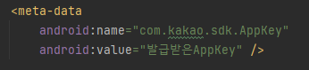

# 포팅메뉴얼

## 1. 개발 환경

### AOS

- Kotlin : 1.7.20
- SDK : 32
- Gradle Version : 7.4
- Android Gradle Plugin Version : 7.3.0
- JDK : 1.8

### IDE

- AndroidStudio : Dolphin 2021.3.1 Patch1

## 2. 배포 시 특이사항

- 카카오톡 공유하기 AppKey 추가
    
    
    
    - AndroidManifest.xml 파일에서 발급받은AppKey 부분에 추가
    
    
    
    - AndroidManifest.xml 파일에서 intent-filter에 AppKey 부분에 추가

- Google Map API 추가
    
    
    
    - AndroidManifest.xml 파일에서 meta-data에 발급받은 API 키 추가

- Firebase 설정
    1. 파이어베이스 콘솔에서 프로젝트 생성
    2. 좌측 사이드바에서 Firestore Database, Authentication, Storage 추가
    3. Android 앱 등록
    4. google-service.json 다운로드 후 Project 탐색기로 변경 후 각 모듈 폴더 밑에 복사
        
        
        
    5. App 수준 gradle에 dependenct 추가
        
        
        

## 3. 빌드 & 배포

### 빌드

1. sync project with gradle files 클릭
2. Android 상단 빌드 버튼 클릭 (Shift + F10)
    
    
    

### 배포

1. 상단 메뉴 Build -> Generate Signed Bundle/APK 클릭
2. Android App Bundle 체크 -> Next 클릭
3. Key store path 선택, key store password, alias, password 작성 후 Next 클릭
4. Release 체크 -> Finish 클릭
5. app/release 경로에 apk 파일 생성 완료
    
    
    

## 4. 외부 서비스 정보

- **Google Map API – Google 지도 API**
    
    URL: [https://developers.google.com/maps/documentation/android-sdk?hl=ko](https://developers.google.com/maps/documentation/android-sdk?hl=ko)
    

- **Firebase – Firebase Store**
    
    URL: [https://firebase.google.com/docs/firestore?authuser=0&hl=ko](https://firebase.google.com/docs/firestore?authuser=0&hl=ko)
    

- **Firebase – Authentication**
    
    URL: [https://firebase.google.com/docs/auth?authuser=0&hl=ko](https://firebase.google.com/docs/auth?authuser=0&hl=ko)
    

- **Firebase – Storage**
    
    URL: [https://firebase.google.com/docs/storage?authuser=0&hl=ko](https://firebase.google.com/docs/storage?authuser=0&hl=ko)
    

- **Kakao 공유 API** – 카카오톡 공유하기
    
    URL: [https://developers.kakao.com/docs/latest/ko/message/android-link](https://developers.kakao.com/docs/latest/ko/message/android-link)
